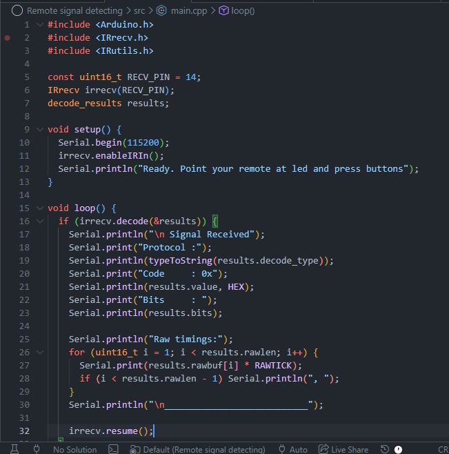
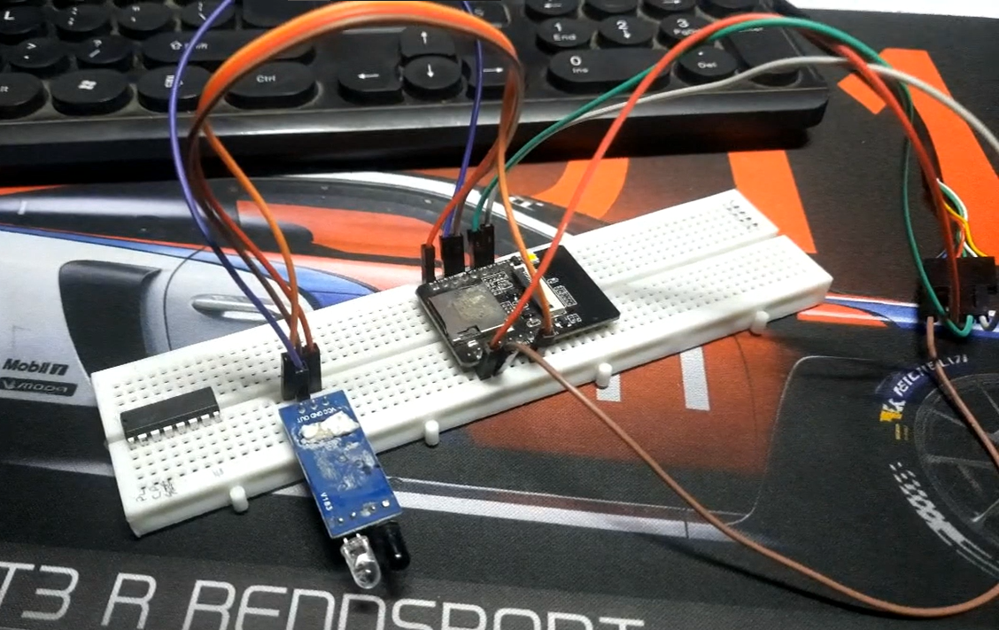
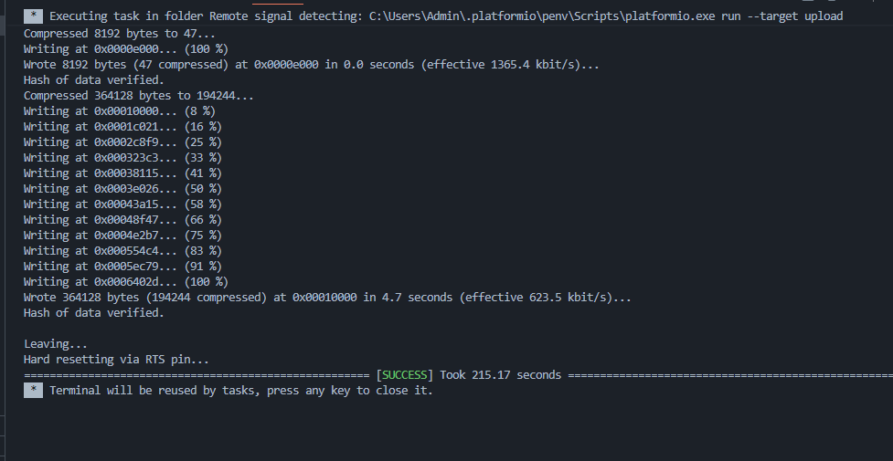

# May 03: First Entry

Just setting up the project in github and forge.hackclub.com

**Total time Spent: 5 min**

# May 03: Research & wiring plan for Signal detecting.

So I researched a bit, I think this can be used. Tho it for esp8266, esp32cam is actually almost the same as esp8266, and I dont think I need to worry about it

I think this wiring plan should work, why not?

| Ir module | esp32 |
| -------- | -------- |
| vcc   | 3v3   |   
| gnd   | gnd   |
| out  | gpio 14 |

and the TX RX 5V GND from esp32cam to a ftdi programmer, but meh, everyone knows these.

**Total time Spent: 25min**

# May 03: Making the firmware

When i press a button on my remote, it fires invisible ir light beam in a specific pattern of pulses,yk like  on and off, really fast at 38kHz. The IR receiver connected to GPIO 14 picks that up and a  timer inside the esp quietly records how long each pulse lasted. once theres a long enough silence, it knows the signal is done and tries to match that pattern against a list of known protocols like NEC, COOLIX, Samsung and so on(used a bit of ai to know about these diffrent protocols). If it finds a match it spits(spit, most appropriate word here lol) out the protocol name and a hex code in the serial monitor, that hex code is basically the fingerprint of that button press. Even if it can't identify the protocol, it still dumps the raw pulse timings which i can use to replay the signal anyway. Then you call resume() and it clears the buffer and starts listening for the next one.
mehh, most of the hard and logical and complex part is already carried out by the library tho.

**Total Time Spent: 40min**

# May 03: Wiring & Flashing the esp

I wired up according to the wiring plan I showed in last entery, I had to combine 2 gnd (one of ir and other of gpio 0 to gnd). And I forgot which model of ftdi I am using. I usually use the esp32cam-mb but currently mine is broken, need to buy new one, so I have 2 other ftdi programmers which I dont remember name and model of, so I had to find the name of it in device manager and google it for datasheet, because the wires are not labelled on mine, just colors. Its a ftdi programmer cable actually which consists of the ftdi programmer circuit near the usb port. The color coding turned out to be, white for recieve data nd green for transmit data, vcc and gnd is obv tho. Mine has a yellow extra wire, but turns out I dont need it

So I am using platform IO for coding and compiling, because VS code is sooo great and platform IO is 10000x faster than crusty arduino IDE. I will do testing and documenting all the the raw pulses or protocols in a seperate file.

**Total Time Spent: 30min**